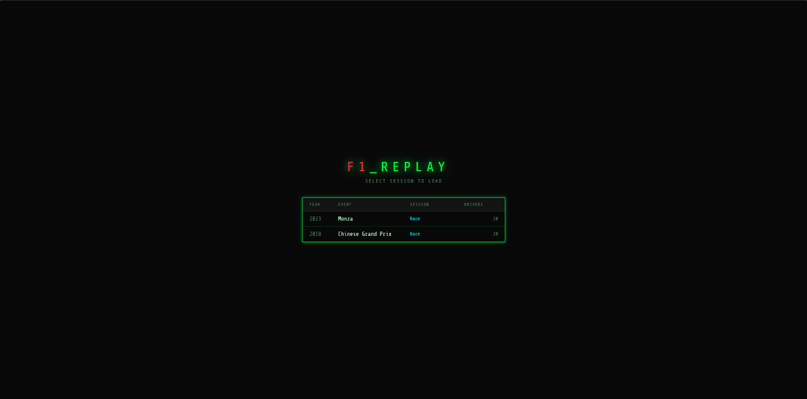
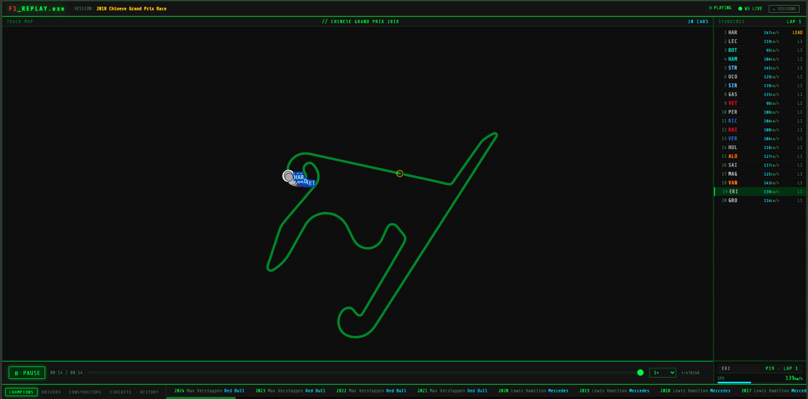

# F1_REPLAY.exe

> A full-stack F1 race replay engine — stream real telemetry data from any Grand Prix (2018–present) in a retro terminal UI.



---

## Features

- **Live replay** of any F1 race from 2018 to present via WebSocket streaming
- **Real telemetry** — speed, throttle, brake, gear, DRS for every driver on every frame
- **SVG track map** with animated car positions and team colors
- **Leaderboard** updating in real-time as positions change
- **Replay controls** — play, pause, seek, 1×/2×/4×/8× speed
- **F1 Encyclopedia** — every driver, constructor, circuit, champion, and era (1950–present)
- **Bulk loader** with resume support — load all 195 race sessions from 2018–2026
- Retro terminal green-on-black aesthetic



---

## Tech Stack

| Layer | Technology |
|---|---|
| Telemetry data | FastF1 (official F1 timing data) |
| Database | MongoDB (local Windows service) |
| Backend | Django 6 + Django REST Framework + Django Channels 4 |
| ASGI server | Uvicorn |
| Frontend | React + Vite |
| Real-time | WebSockets (Django Channels, InMemoryChannelLayer) |

---

## Project Structure

```
F1_replay/
├── engine/
│   ├── __init__.py
│   ├── loader.py          # FastF1 session download + driver metadata
│   ├── timeline.py        # Aligns all 20 cars to a shared millisecond clock
│   ├── storage.py         # MongoDB read/write (sessions, frames, track_maps)
│   └── encyclopedia.py    # Static F1 data: drivers, constructors, circuits, eras
│
├── f1_django/             # Django + Channels backend
│   ├── manage.py
│   ├── requirements.txt
│   ├── f1_project/
│   │   ├── settings.py    # ASGI config, MongoDB, channel layers
│   │   ├── urls.py
│   │   └── asgi.py
│   └── api/
│       ├── views.py       # DRF REST endpoints
│       ├── consumers.py   # WebSocket consumer (frame streaming)
│       ├── routing.py
│       ├── urls.py
│       └── db.py          # Async Motor MongoDB client
│
├── frontend/              # React + Vite UI
│   ├── src/
│   │   ├── App.jsx
│   │   ├── terminal.css   # Retro terminal theme
│   │   ├── hooks/
│   │   │   └── useReplay.js    # WebSocket state hook
│   │   └── components/
│   │       ├── SessionPicker.jsx
│   │       ├── TrackMap.jsx
│   │       ├── Leaderboard.jsx
│   │       ├── TelemetryPanel.jsx
│   │       ├── ReplayControls.jsx
│   │       └── Encyclopedia.jsx
│   ├── package.json
│   └── vite.config.js
│
├── load_race.py           # Load a single race into MongoDB
├── bulk_load.py           # Load all races (2018–present) with resume support
├── seed_f1_data.py        # Seed encyclopedia data into MongoDB
├── data_cache/            # FastF1 auto-cache (created on first run)
└── README.md
```

---

## Screenshots

| Session Picker | Replay View |
|---|---|
|  |  |

| Track Map | Encyclopedia |
|---|---|
|  |  |

> Add screenshots to `docs/screenshots/` named `ss1.png` through `ss4.png`.

---

## Setup

### 1. Prerequisites

- Python 3.11+
- Node.js 18+
- MongoDB running locally on port 27017

**Install MongoDB on Windows (no Docker needed):**
```powershell
winget install MongoDB.Server
# MongoDB installs as a Windows service and starts automatically
```

### 2. Python dependencies

```bash
# Telemetry engine
pip install fastf1 pymongo motor numpy pandas

# Django backend
cd f1_django
pip install -r requirements.txt
cd ..
```

### 3. Frontend dependencies

```bash
cd frontend
npm install
cd ..
```

---

## Running

### Start the backend

```bash
cd f1_django
uvicorn f1_project.asgi:application --host 0.0.0.0 --port 8000 --reload
```

### Start the frontend (separate terminal)

```bash
cd frontend
npm run dev
# Opens at http://localhost:5173  (proxies /api and /ws to :8000)
```

### Seed encyclopedia data (run once)

```bash
python seed_f1_data.py
```

---

## Loading Race Data

### Load a single race

```bash
# Full race (takes ~5–20 min depending on session length)
python load_race.py --year 2024 --event Monaco --session Race

# Quick test — first 300 frames only
python load_race.py --year 2023 --event Monza --session Race --test
```

### Bulk load — all races from 2018 to present

```bash
# Load every Race session from 2018 onward (195 sessions, resumes if interrupted)
python bulk_load.py --from-year 2018 --session Race

# Load a single year
python bulk_load.py --year 2024 --session Race

# Dry run — see what would be loaded without downloading
python bulk_load.py --from-year 2018 --dry-run

# Check progress
python bulk_load.py --status
```

> **Note:** Early 2018 races (Australia, Bahrain) may show `FAIL — No telemetry found`. This is expected — FastF1 does not have position data for the very first rounds of 2018. The loader skips these automatically and continues. 2018 Chinese GP onward is typically available.

> **Note:** Full bulk load takes several hours. FastF1 downloads from official F1 servers and caches everything in `data_cache/` so interrupted runs pick up where they left off.

---

## REST API

| Method | Endpoint | Description |
|---|---|---|
| GET | `/api/sessions/` | List all loaded sessions |
| GET | `/api/sessions/<id>/` | Session detail + driver list |
| GET | `/api/track-map/<event>/` | Track outline points (latest year) |
| GET | `/api/track-map/<event>/<year>/` | Track outline for specific year |
| GET | `/api/frame/<session_id>/<t_ms>/` | Nearest frame at timestamp |
| GET | `/api/encyclopedia/champions/` | All WDC/WCC champions by year |
| GET | `/api/encyclopedia/drivers/` | All notable drivers |
| GET | `/api/encyclopedia/constructors/` | All constructors |
| GET | `/api/encyclopedia/circuits/` | All circuits |
| GET | `/api/encyclopedia/history/` | F1 eras 1950–present |

---

## WebSocket Protocol

Connect to:
```
ws://localhost:8000/ws/replay/<session_id>/
```

**Client → Server:**
```json
{ "action": "play",   "t_start": 4941726, "speed": 1.0 }
{ "action": "pause" }
{ "action": "resume" }
{ "action": "seek",   "t": 5200000 }
{ "action": "speed",  "speed": 4.0 }
```

**Server → Client:**
```json
{ "type": "frame",  "t": 4941726, "cars": { "LEC": { "x": 0.41, "y": 0.29, "speed": 187, "throttle": 72, "brake": false, "gear": 5, "drs": false, "lap": 1, "pos": 1 } } }
{ "type": "status", "state": "playing", "t": 4941726, "t_min": 4941726, "t_max": 8203441, "speed": 1.0 }
{ "type": "error",  "message": "session not found" }
```

---

## MongoDB Collections

**`sessions`**
```json
{
  "_id": "...",
  "year": 2024,
  "event": "Monaco",
  "session_type": "Race",
  "total_laps": 78,
  "drivers": [
    { "code": "LEC", "full_name": "Charles Leclerc", "team": "Ferrari", "color": "#E8002D", "number": 16 }
  ],
  "track_bounds": { "x_min": -1200, "x_max": 900, "y_min": -800, "y_max": 600 }
}
```

**`frames`** (one document per ~100 ms tick, per session)
```json
{
  "session_id": "...",
  "t": 4941726,
  "cars": {
    "LEC": { "x": 0.412, "y": 0.288, "speed": 187, "throttle": 72, "brake": false, "gear": 5, "drs": false, "lap": 3, "pos": 1 }
  }
}
```

**`track_maps`**
```json
{
  "event": "Monaco",
  "year": 2024,
  "points": [{ "x": 0.42, "y": 0.31 }],
  "n_points": 847
}
```

**Encyclopedia collections:** `f1_seasons`, `f1_drivers`, `f1_constructors`, `f1_circuits`, `f1_history`

---

## Environment Variables

| Variable | Default | Description |
|---|---|---|
| `MONGO_URI` | `mongodb://localhost:27017` | MongoDB connection string |
| `F1_DB_NAME` | `f1_replay` | Database name |
| `REDIS_URL` | *(unset)* | Optional Redis URL for Channels (uses in-memory if unset) |
| `DJANGO_SECRET_KEY` | *(dev key)* | Set in production |
| `DEBUG` | `1` | Set to `0` in production |
| `ALLOWED_HOSTS` | `localhost 127.0.0.1` | Space-separated hostnames |

---

## Data Coverage

| Years | Sessions | Notes |
|---|---|---|
| 2018 | ~18/20 rounds | First ~2 rounds of 2018 lack position telemetry |
| 2019–2021 | All rounds | Full telemetry |
| 2022–2025 | All rounds | Full telemetry + improved accuracy |
| 2026 | Partial | Season in progress |

Data sourced via [FastF1](https://github.com/theOehrly/Fast-F1) — the official F1 timing data library.

---

## License

MIT
